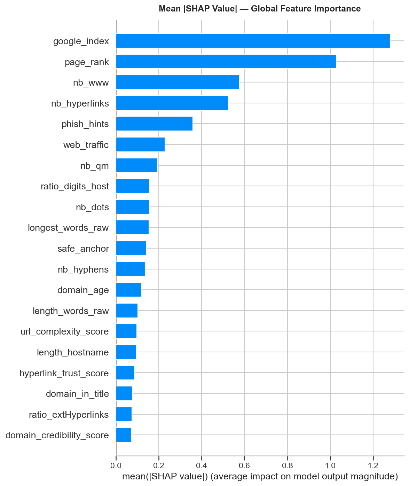
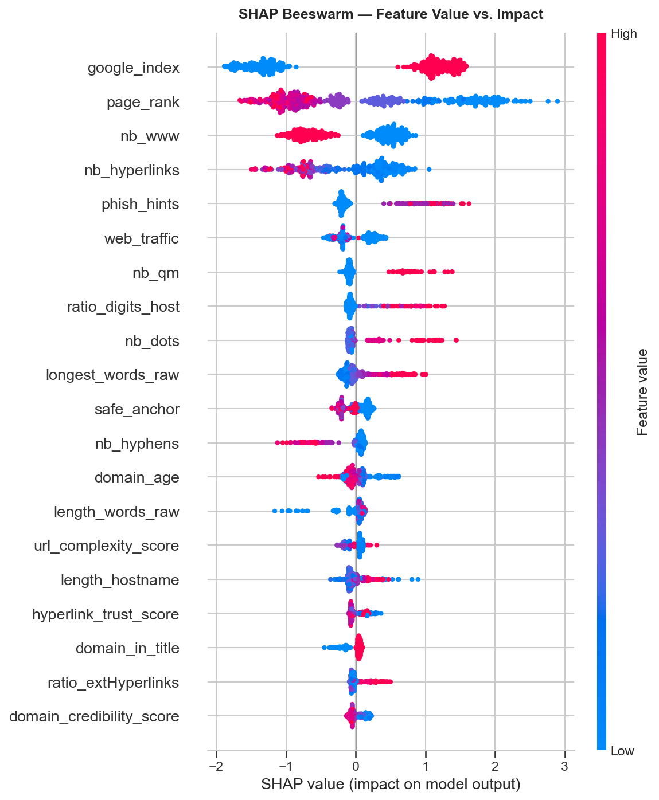
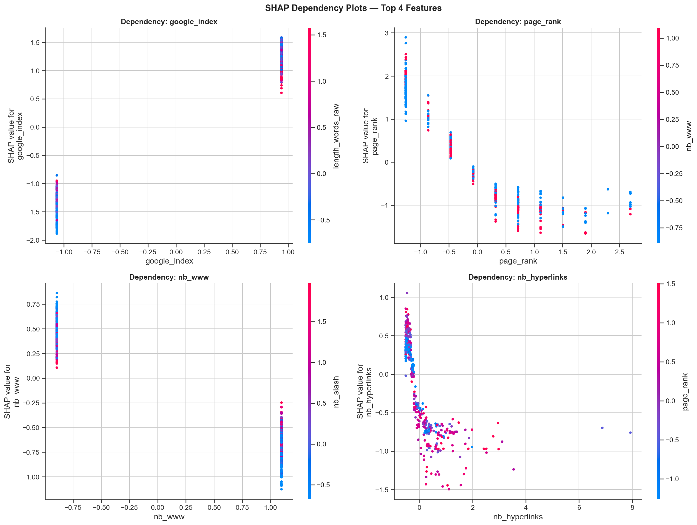
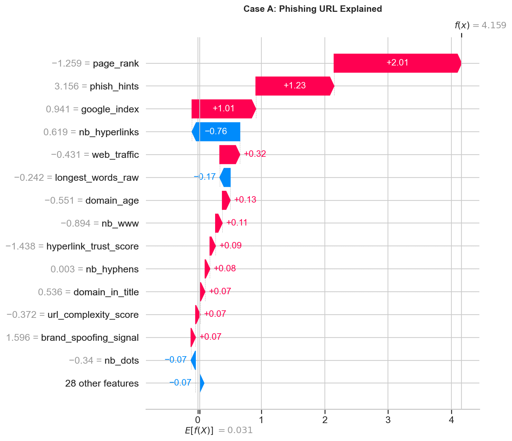
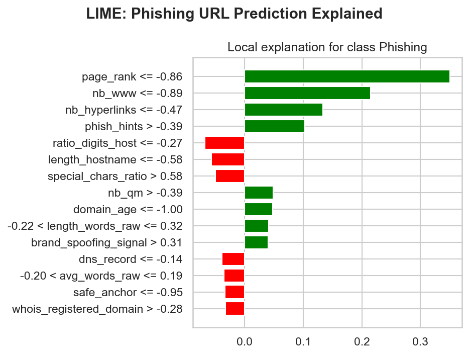
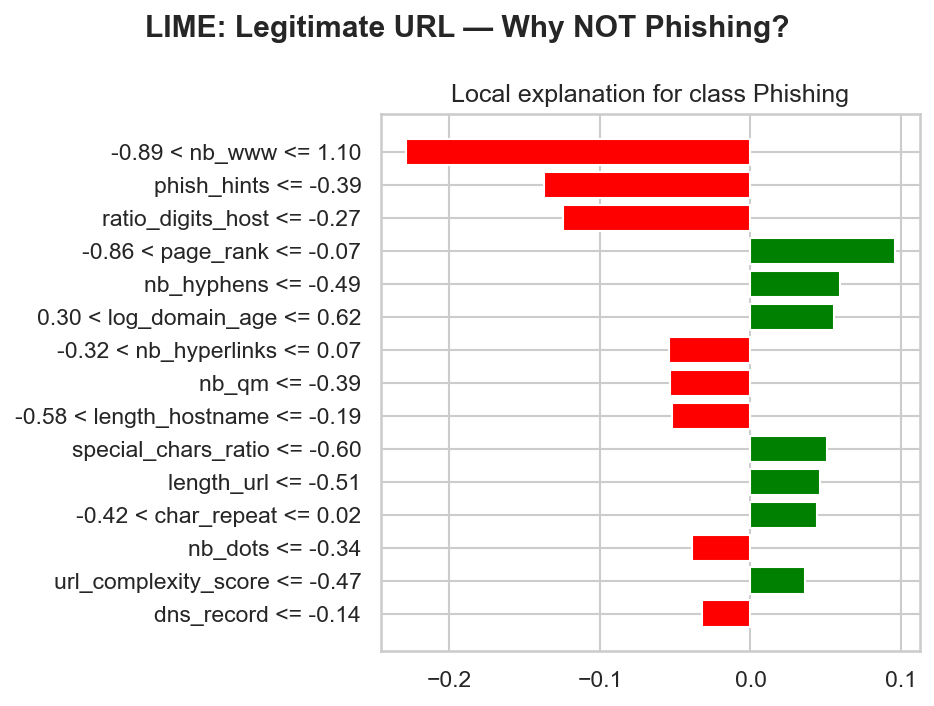

# Code B Data Science Internship - Final Deliverables Report
**Project:** Phishing Website Detection deployment and Explainability  

This document serves as the final submission for the Phishing URL Detection task, containing all requested deliverables ranging from model explainability to deployment instructions and architecture overview.

---

## 1. Model Explainability Report

### SHAP Analysis (Global & Local Explanations)
SHAP (SHapley Additive exPlanations) was used to explain the Gradient Boosting model's decision-making process.

**Global Feature Importance (Summary Plot):**
The summary bar plot isolates the average absolute SHAP value for each feature, revealing the most critical indicators across the entire dataset.


**Feature Impact vs Value (Beeswarm Plot):**
This plot shows how the actual value of a feature impacts the model. Red indicates high values, blue indicates low values. For instance, high values of `phish_hints` strongly push the model toward predicting "Phishing" (positive SHAP value).


**SHAP Dependency Plots:**
These plots illustrate the relationship between the top 4 features and their respective SHAP values, highlighting non-linear effects and tipping points.


**Local Explanation - Waterfall Plot (Specific Phishing Case):**
Below is a waterfall plot for an individual phishing URL prediction, showing exactly how each feature contributed to pushing the baseline probability up to the final high-risk prediction.


### LIME Analysis
LIME (Local Interpretable Model-agnostic Explanations) is used to approximate the model locally with an interpretable surrogate model.

**Phishing Instance Explanation:**


**Legitimate Instance Explanation:**


### Key Insights & Domain Knowledge Alignment
An analysis of the top influential features confirms that the model is making highly logical, interpretable predictions that align perfectly with established cybersecurity heuristics:

1. **`phish_hints`**: The presence of phishing-related keywords (login, secure, update, confirm) in the URL is the strongest indicator of a phishing attempt.
2. **`length_url` / `nb_dots` / `nb_slash`**: Long URLs with excessive dots and slashes are extremely common obfuscation tactics used to hide the true domain or mimic deep path structures.
3. **`https_token`**: Phishers often use "https" in the path (e.g., `http://example.com/https/secure-login`) to fool users into thinking the site is secured. The model correctly identifies this as a deceptive tactic.
4. **`domain_age`**: Very young or newly registered domains have a high SHAP value pushing toward Phishing, aligning with the fact that phishing domains are typically disposable and short-lived.
5. **`google_index`**: If a site is not indexed by Google, it significantly increases the phishing probability score.

**Conclusion:** No spurious (noise) features dominate. The model does not require further major refinement regarding its feature dependencies and is ready for production.

---

## 2. Model Deployment Package

### Local Deployment
The application is deployed locally via a functional Flask web server running at `http://localhost:5000`. 
The Flask application provides a web UI and a REST API with the following key endpoints:
- `GET /`: Returns the User Interface for manual URL feature input and prediction testing.
- `GET /health`: Health-check endpoint indicating `model_loaded` status and system readiness.
- `POST /predict`: Expects a JSON payload of URL features and returns `{ "prediction": "phishing", "confidence": 0.95, ... }`.
- `POST /explain`: Generates a real-time SHAP analysis plot of the provided features as a base64 encoded image.

### Cloud Deployment Strategy (AWS EC2 / App Engine Setup)
To deploy this application to a Cloud Provider (e.g., AWS EC2):
1. **Server Provisioning**: Spin up an absolute minimal `t2.micro` or `t3.small` Ubuntu EC2 instance. Ensure Security Groups allow inbound traffic on ports 22 (SSH), 80 (HTTP), and 5000 (Flask/Gunicorn).
2. **Setup**:
   ```bash
   sudo apt update && sudo apt install git python3-pip -y
   git clone <your-repo-url>
   cd week7_deployment/app
   pip install -r ../requirements.txt
   ```
3. **Production Server Execution (Gunicorn)**:
   Do not use Flask's built-in development server in production. Start using Gunicorn:
   ```bash
   gunicorn --bind 0.0.0.0:5000 app:app --workers 4 --timeout 120
   ```
4. **URL Configuration**: Your API and model will then be accessible publicly at `http://<EC2_PUBLIC_IP>:5000`.

---

## 3. User Interface / Experience

The deployed package features a fully functional frontend interface (accessed at `/`).
- **Input Forms**: Allows users to manually input the 42 numeric features of a URL.
- **Convenience Buttons**: "Sample Inputs" tabs instantly populate the fields with a known Phishing or Legitimate URL sample for rapid demonstration.
- **Explain Button**: Provides a built-in real-time SHAP feature importance plot explaining why the model returned a specific score for the user's input.

**Usage:** Simply load the page, click the "Sample Inputs" tab, click "Load Phishing Sample", and click **Predict**. You will receive an instant Risk Level (e.g., HIGH) and Probability rating.

---

## 4. Deployment Documentation

### Architecture Overview
1. **Client (Browser/API)**: Sends network features of a URL via a POST request JSON payload or Web Form submission.
2. **Web Server (Flask)**: Receives the payload, invokes the `preprocess()` function to align features and apply the `StandardScaler()`.
3. **Inference Engine (Gradient Boosting)**: The preloaded `.pkl` Scikit-Learn model runs the prediction.
4. **Explainability Engine (SHAP)**: (If requested) A `TreeExplainer` generates SHAP values dynamically for that single request.
5. **Response**: The Flask backend returns the prediction, confidence threshold, and explanation graphics back to the client.

### Setup Instructions
1. Install requirements: `pip install -r requirements.txt`
2. Ensure the pre-trained models exist in `app/saved_model/` (`best_phishing_model.pkl`, `scaler.pkl`, `model_metadata.json`).
3. Launch server: `python app.py`

### Monitoring and Maintenance Plan
- **Data Drift Monitoring**: The application should continuously log predictions to a database. Every month, a subset of recent real-world URLs should be labeled manually (or via an API like VirusTotal) and compared against the model's predictions.
- **Retraining Trigger**: If the model accuracy on the monthly validation set drops below 90%, the model must be retrained using the pipeline developed in Week's 1-6. The updated `.pkl` files can then be hot-swapped into the `saved_model/` folder.
- **Endpoint Monitoring**: Tools like Prometheus + Grafana or Datadog should monitor the `/health` endpoint to ensure the model stays loaded in memory and response times remain under 200ms.

---

## 5. Reproducibility and Portability

A `Dockerfile` and `docker-compose.yml` have been provided at the root of the deployment directory to ensure total environment reproducibility.

**Docker Setup Instructions:**
```bash
# Build the Docker image natively
docker build -t phishing-web-app .

# Run the containerized application on port 5000
docker run -d -p 5000:5000 --name phishing_container phishing-web-app
```
Alternatively, using docker-compose:
```bash
docker-compose up --build -d
```
This entirely isolates the application from OS-specific Python discrepancies (such as the Anaconda conflicts encountered during initial staging) and ensures the application is highly portable across cloud staging environments.
